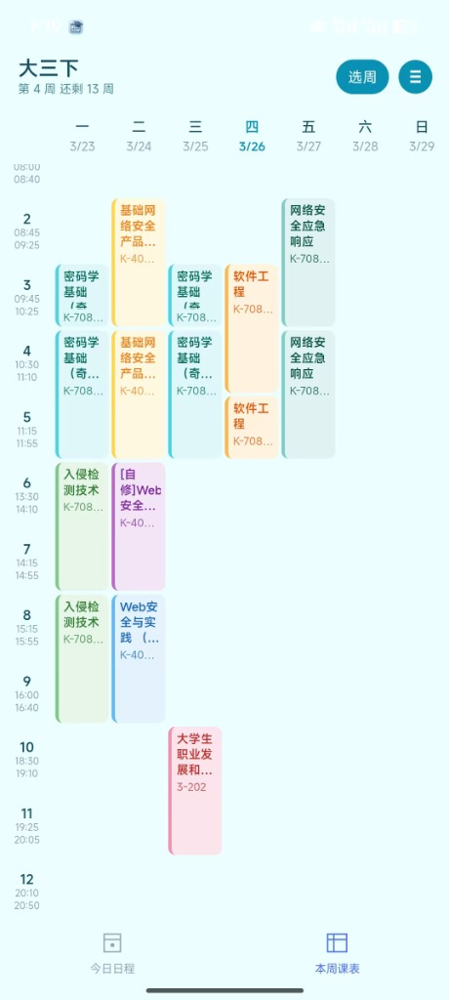
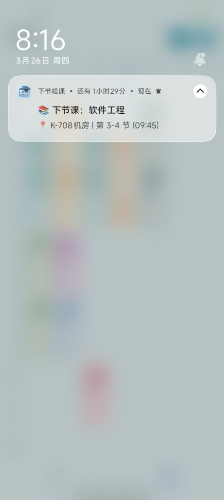
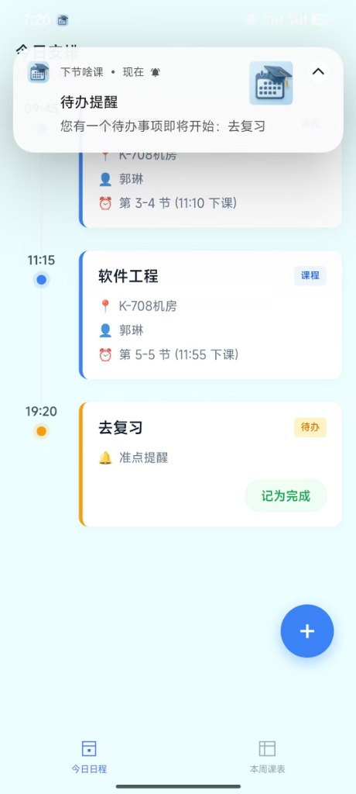

# 📚 下节啥课

> 一款基于 uni-app 的多课表管理应用，支持多种教务系统课表导入、多课表切换、作息时间自定义、以及 Android 常驻通知提醒与待办事项消息提醒。

---

## 📸 效果预览

### 📅 课表主界面


### 🔔 智能课程提醒 (锁屏/状态栏)


### 📝 今日日程与待办


## ✨ 功能特性

### 📅 多课表管理

- 支持同时维护**多套独立课表**（如"大三下"、"大四上"），自由切换
- 每个课表独立存储课程数据、学期起始日期和作息时间
- 课表支持**新建 / 编辑 / 删除 / 切换 / 重新导入**等完整生命周期管理

### 📥 教务系统导入

- 适配国内七大主流教务生态及其新老变种：**正方**、**URP**、**青果**、**强智**、**金智 (Wisedu)**、**南软**、**超星**
- 采用模块化 Parser 架构，完美抹平各类系统的新老版本（如现代 Grid 布局、传统 Table网格 及 JSON API）页面与接口差异，提供统一的数据结构
- 整合全网公开与开源的教务数据资源，内置支持全国上千所高校的教务系统网址，涵盖各项主流教务系统类型，支持快捷搜索与一键匹配
- 支持 WebView 内嵌登录对应的教务系统网页并自动抓取课表数据
- 自动解析对应系统的格式，提取课程名称、教师、教室、节次、周次（支持单双周）

### 📅 课表展示

- **周视图**课表网格，支持左右滑动切换周次
- 自动高亮"今天"所在的日期列
- 课程卡片采用 **12 色和谐配色方案**，同名课程始终保持一致颜色
- 点击课程卡片可查看**课程详情弹窗**（时间 / 教室 / 教师 / 周次）
- 支持快速选择周次的弹窗式周次选择器

### ⏰ 作息时间

- 内置**冬令时**（下午 13:30 开始）和**夏令时**（下午 14:00 开始）两种预设
- 支持逐节自定义每节课的起止时间
- 统一课时长度开关，可一键设定所有课节的时长（20~60 分钟可选）

### 🔔 通知提醒系统

- **双重通知体系**：采用“常驻状态栏”与“定时任务推送”相结合的提醒机制。
- **Android 常驻通知**：
- 利用 Android 原生 `NotificationManager` 实现**通知栏常驻提醒**
- 智能判断当前课程状态：
  - 📅 **学期未开始** → 显示距开学天数倒计时
  - 🟢 **正在上课** → 显示课程名、教室、剩余分钟
  - ⏰ **即将上课** → 显示下节课名称及时间差
  - 🎉 **今天没课** → 轻松提示
  - ✨ **今天的课上完了** → 辛苦提示
  - 🎓 **本学期课程已结束** → 精确到天级别的结课判断
- 每分钟自动刷新通知内容（基于 Android 原生 Handler 定时器 + WakeLock 保活，后台也能持续更新）
- 支持请求忽略电池优化，减少 Doze 模式对后台更新的影响
- **待办事宜定时提醒**：
  - 支持为每项待办设置独立的**提醒策略**（准点、提前 5/15/30 分钟）。
  - 基于 Android 系统闹钟/定时器实现，确保在设定的时间点准时弹出通知，防止错过重要事务。

## 🏗 项目结构

```
school-timetable/
├── App.vue                     # 应用入口，通知服务启动与全局样式
├── main.js                     # uni-app 入口
├── manifest.json               # 应用配置 (appid、权限、图标等)
├── pages.json                  # 页面路由配置
│
├── pages/
│   ├── index/
│   │   └── index.vue           # 📊 主页 - 课表网格展示 + 周次切换 + 课程详情
│   ├── today/
│   │   └── today.vue           # 📅 今日日程 - 聚合今日课程与待办，支持通知栏快捷预览
│   ├── todo/
│   │   └── add.vue             # ✅ 待办事宜 - 添加/管理个人待办事项
│   ├── import/
│   │   ├── select-school.vue   # 🏫 选择学校页 - 搜索并选择要导入的高校
│   │   └── import.vue          # 📥 导入页 - WebView 登录对应教务系统自动抓取数据
│   ├── schedule/
│   │   └── schedule.vue        # ⏰ 作息编辑页 - 逐节自定义起止时间
│   └── profile/
│       ├── list.vue            # 📋 课表管理页 - 查看/切换/编辑/删除课表
│       ├── create.vue          # ➕ 新建课表页 - 设置名称/开学日期/时间预设
│       └── edit.vue            # ✏️ 编辑课表页 - 修改名称和开学日期
│
└── utils/
    ├── storage.js              # 💾 存储层 - 多Profile管理 + 课程/待办/设置CRUD
    ├── parsers/                # 🧩 解析器引擎目录
    │   ├── index.js            # 统一入口与分发引擎
    │   ├── dom_matrix_helper.js # 辅助工具 - 处理复杂表格矩阵解析
    │   ├── zhengfang_new.js    # 正方教务解析器
    │   ├── urp.js              # URP教务解析器 (含 urp_new.js)
    │   ├── kingosoft.js        # 青果教务解析器 (含 kingosoft_new.js)
    │   ├── qiangzhi.js         # 强智教务解析器 (含 qiangzhi_old.js)
    │   ├── wisedu.js           # 金智教务解析器
    │   ├── south_soft.js       # 南软教务解析器
    │   └── chaoxing.js         # 超星教务解析器
    ├── schools.json            # 🏫 内置支持的高校及教务系统类型配置表
    ├── parser.js               # 🔍 旧版通用解析工具
    ├── time.js                 # ⏱ 时间模块 - 作息预设 + 周次计算
    ├── next-class.js           # 🧠 状态引擎 - 分析当前/下一节课状态
    ├── notification.js         # 📢 通知模块 - Android原生常驻通知
    └── color.js                # 🎨 配色模块 - 12色和谐配色自动分配
```

---

## 🧱 技术栈

| 技术                   | 说明                                                            |
| ---------------------- | --------------------------------------------------------------- |
| **uni-app** (Vue 3)    | 跨平台应用开发框架                                              |
| **Android Native API** | 通过 `plus.android` 调用 `NotificationManager` 实现常驻通知     |
| **LocalStorage**       | 基于 `uni.getStorageSync` / `uni.setStorageSync` 管理多课表数据 |

---

## 🚀 快速开始

### 环境要求

- [HBuilderX](https://www.dcloud.io/hbuilderx.html)（推荐最新版本）
- Node.js（仅在需要微信小程序开发时）
- Android 手机或模拟器（测试通知功能）

### 运行步骤

1. **克隆项目**

   ```bash
   git clone https://github.com/baoozak/timetable.git
   cd school-timetable
   ```

2. **使用 HBuilderX 打开项目**
   - 打开 HBuilderX → 文件 → 导入 → 从本地目录导入

3. **运行到设备**
   - **Android 手机**：连接 USB → 运行 → 运行到手机或模拟器 → 选择设备
   - **微信小程序**：运行 → 运行到小程序模拟器 → 微信开发者工具
   - **H5 浏览器**：运行 → 运行到浏览器

4. **首次使用流程**

   ```
   打开 App → 点击"去导入" → 新建课表（输入名称 + 选择开学日期 + 选择作息预设）
   → 进入导入页面 → 登录教务系统并导入课表 → 返回主页查看课表
   ```

---

## 📝 更新日志

### v1.1.6（当前版本）

- **课表解析重构**：优化了 Kingosoft 和 URP 解析器，提升了对复杂表格（rowspan/colspan）的兼容性。
- **学校数据库扩展**：整合了数千所高校数据。
- **界面优化**：优化了部分 UI 界面。

---

## 📄 License

本项目采用 [MIT License](LICENSE) 许可协议。
